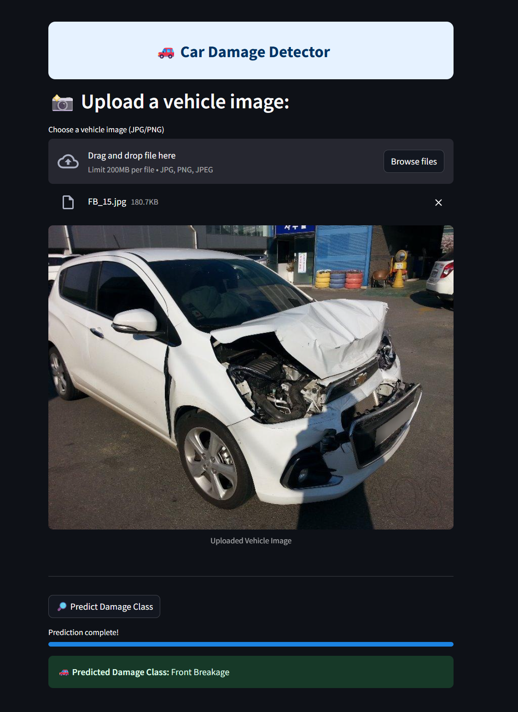

# Car Damage Detector

An intelligent web application built with Streamlit that automatically detects and classifies vehicle damage from images, helping users, insurers, and car repair professionals quickly assess a car’s condition. By simply uploading a photo of a vehicle (preferably from a third-quarter front or rear view), the app uses a deep learning model to predict the type of damage.

---

<!-- ## 🌐 Live Website
You can try the tool live here: **[Credit Risk Evaluator](https://vaibhav-project-credit-risk-evaluator.streamlit.app/)** -->

---

## 🛠 Features  
- Upload a vehicle photo and instantly get a prediction for damage type. 
- Classifies images into 6 target classes:
   - Front Normal
   - Front Crushed
   - Front Breakage
   - Rear Normal
   - Rear Crushed
   - Rear Breakage 
- Uses ResNet50 fine-tuned on a curated car damage dataset.
- Works well on images with varied lighting and angles.
- Simple, fast, and deployable with no backend server required.  
- Lightweight codebase optimized for local or cloud usage.  

---

## 📂 Project Structure

```
Car_Damage_Detector/
│
├── model/
│   ├── saved_model.pth          # Trained ResNet50 model weights
│
├── app.py                       # Streamlit application logic
├── model_helper.py              # Prediction logic using the trained model
├── LICENSE                      # Apache License file
├── requirements.txt             # Python dependencies
└── README.md                    # Project documentation
```

---

## 🚀 How to Run Locally  
### Prerequisites:  
- Python 3.8+

1. **Clone the repository**:
   ```bash
   git clone https://github.com/vaibhavgarg2004/Car-Damage-Detector.git
   cd Car-Damage-Detector
   ```
2. **Install dependencies**:   
   ```commandline
    pip install -r requirements.txt
   ```
3. **Run the Streamlit app**:   
   ```commandline
    streamlit run app.py
   ```

---

## 🧠 How It Works

1. **Image Upload & Display**  
   - The user uploads a car image (JPG/PNG) through the Streamlit interface.
   - The app saves the uploaded file locally (e.g., as a temporary file) and displays it in the app. 

2. **Preprocessing & Model Inference**  
   - The saved image is resized, normalized, and converted to a tensor.  
   - The pre-trained ResNet50 model processes the image to classify it into one of six damage categories. 

3. **Prediction Output**  
   - The predicted damage class is instantly shown in the app interface, allowing users to quickly understand the car’s condition.

---
   
## 🖼️ Application Snapshot



---

## 📄 License
This project is licensed under the **Apache License 2.0**. See the [LICENSE](./LICENSE) file for details.

---

*Drive smarter. Detect damage instantly.*

